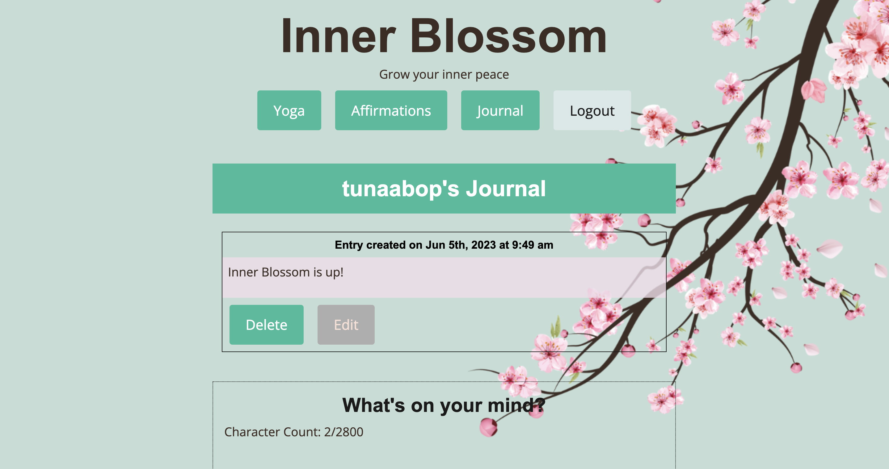

# Inner Blossom: a Mental Health SPA

## App Description

[Inner Blossom](https://inner-blossom.herokuapp.com/) is a single-page application (SPA) brewed to provide well-rounded resources for users to assess and address their mental concerns, with options to display and hide features such as yoga, journaling, and a daily unique quote. Just like drinking a cup of inner blossom jasmine tea, it provides a therapeutic place for relaxation and stress-relief.

## Tech Stack
- React (front end)
- GraphQL with a Node.js and Express.js server
- MongoDB and the Mongoose ODM (database)
- Heroku (deployment)

## User Story
As someone who needs **movement** in my life, I want to receive random yoga poses so that I can relax a little more.
As someone who seeks inspiration and from quotes I want to receive **affirmations** that will motivate me throughout the day.
As someone who needs to organize my thoughts, I want a place to write **reflections** so that I can clear my mind and de-stress.
As someone who wants to prioritize my mental health, I want to have the option to **customize** specific features to show and use on this app.

## Link to our [Heroku App]([https://inner-blossom.herokuapp.com/](https://inner-blossom.herokuapp.com/))

## App Screenshots

## Credits
- Yoga images from <a href="https://www.verywellfit.com/essential-yoga-poses-for-beginners-3566747">Very Well Fit</a>
- Inspirational quotes provided by <a href="https://zenquotes.io/" target="_blank">ZenQuotes API</a>

## Our Team

### **Tina Wang** ###
> GitHub [@tunaabop](https://github.com/tunaabop) &nbsp;&middot;&nbsp;
### **Rachel Schumann** ###
> GitHub [@raeludwig](https://github.com/raeludwig) &nbsp;&middot;&nbsp;
### **Yasmin Sanchez** ###
> GitHub [@yasmins021](https://github.com/yasmins021) &nbsp;&middot;&nbsp;
### **Jacob Alvarado** ###
> GitHub [@Sonek0](https://github.com/Sonek0) &nbsp;&middot;&nbsp;
